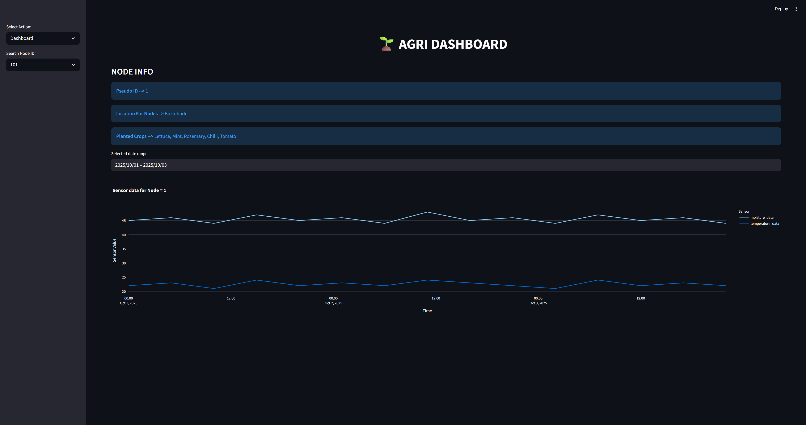
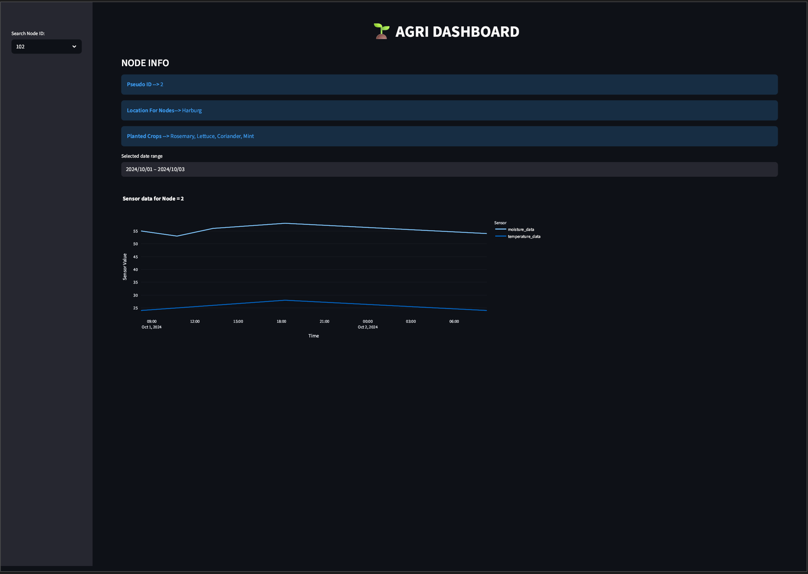

# WELCOME TO AGRI DATABASE MANAGEMENT PROJECT

## DISCLAIMER
Currently used data in this project is randomly generated and should not be used to grow any crop. Files will be updated
as more reliable data is available or as the project progress.

## PROJECT OVERVIEW
The idea of this project is create a simple relational database for an agricultural project. In this project, the
data is acquired for various planted crops across Germany using moisture and ambient temperature sensor. Currently, the data
is randomly generated but later on it would be merged with a greater embedded project whereby data will be acquired from 
nodes (ESP32) with relevant sensors placed in the soil where crops are planted, that data is then transferred to RaspberryPI
which then transfers it to the POSTGRESQL database. The protocol that will be used for transmission of data from sensors to database is "MQTT".

## FLOW OF DATABASE
The database is created in PostGreSQL using psql and PGAdmin called "**agridb**". Later on python scripts are used to collect and 
store data in the database using ETL pipeline. Each major step along the way is logged into a separate log file.

The data from the sensor shall be first buffered as a CSV which is then extracted using pandas CSV read and then transformed
by converting into right python format so SQL can insert the data, transform script also checks if there is any duplication in
the data stream in order to stop writing redundant data. Transformed dataframes are then sent to load script where the relevant
tables are created for esp_nodes, sensors and crops and then dataframe is inserted into the tables as a list of rows.

Once the database is created and loaded with data then the streamlit script is called, which connects to database and acquire
information about all the nodes and then based on the user selection get the pseudo_id, crop_name, moisture_data, temperature_data 
and last_updated information about that particular node and display this information as shown below in the picture. Streamlit detects 
the change in database and prompt to update. Updated data for the respective node will then be available almost instantly.

## FURTHER ENHANCEMENTS
The database and dashboard is incorrectly in its interim stage, naturally more columns/tables will be added like more sensors
or actuator status tables for connected motors/valves. Furthermore, the dashboard will be enhanced by adding authentication for
different users so they can only access data for the nodes connected for them and a separate admin access for extra information.
More information for sensors and other smart calculation would also be displayed so user can perform trend analysis and take
smart and timely decisions regarding the respective crop like how much watering is required in the next week or plan to water the 
plants in a defined quantity if going on a vacation and more.

## SOME PICTURES FOR DASHBOARD

